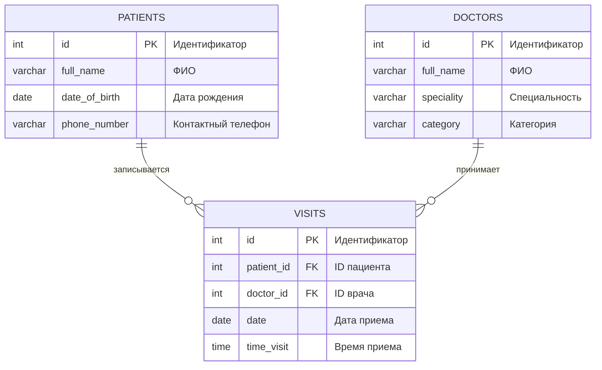

# Лабораторная работа 1. Проектирование структуры БД

## Выбор задачи

**Задание:** Система записи пациентов к врачам

Имеются **Пациенты** (ФИО, дата рождения, контактный телефон) и **Врачи** (ФИО, специальность, категория). Пациент может записаться на прием к нескольким врачам, причем к каждому врачу — на определенную дату и время.

**Выходные документы (запросы):**
1. Выдать список пациентов, записанных к указанному врачу, упорядоченный по ФИО.
2. Выдать список пациентов и количество запланированных у них приемов, упорядоченный по ФИО.

## ER-диаграмма



## Логическая модель

**PATIENTS (Пациенты):**
- id: INTEGER (Первичный ключ)
- full_name: VARCHAR(40) (ФИО)
- date_of_birth: DATE (Дата рождения)
- phone_number: VARCHAR(50) (Контактный телефон)

**DOCTORS (Врачи):**
- id: INTEGER (Первичный ключ)
- full_name: VARCHAR(40) (ФИО)
- speciality: VARCHAR(50) (Специальность)
- category: VARCHAR(50) (Категория)

**VISITS (Записи на прием):**
- id: INTEGER (Первичный ключ)
- patient_id: INTEGER (Внешний ключ к PATIENTS.id)
- doctor_id: INTEGER (Внешний ключ к DOCTORS.id)
- date: DATE (Дата приема)
- time_visit: TIME (Время приема)

**Связи:**
- Один пациент может иметь много записей (1:M)
- Один врач может иметь много записей (1:M)

---

# Лабораторная работа 2. Инсталляция БД на сервере

## Физическая модель для PostgreSQL

```sql
CREATE TABLE IF NOT EXISTS belousov2262.doctors(
    id SERIAL PRIMARY KEY,
    full_name VARCHAR(40),
    speciality VARCHAR(50),
    category VARCHAR(50)
);

CREATE TABLE IF NOT EXISTS belousov2262.patients(
    id SERIAL PRIMARY KEY,
    full_name VARCHAR(40),
    date_of_birth DATE,
    phone_number VARCHAR(50)
);

CREATE TABLE IF NOT EXISTS belousov2262.visits(
    id SERIAL PRIMARY KEY,
    patient_id INT REFERENCES belousov2262.patients(id),
    doctor_id INT REFERENCES belousov2262.doctors(id),
    date DATE,
    time_visit TIME
);
```
## раздел Tables


## Заполнение таблиц данными

```sql
INSERT INTO belousov2262.doctors (full_name, speciality, category) VALUES
('Иванов Петр Сергеевич', 'Терапевт', 'Высшая'),
('Сидорова Анна Владимировна', 'Кардиолог', 'Первая'),
('Петров Михаил Андреевич', 'Невролог', 'Высшая'),
('Козлова Елена Ивановна', 'Эндокринолог', 'Вторая');

INSERT INTO belousov2262.patients (full_name, date_of_birth, phone_number) VALUES
('Смирнов Алексей Иванович', '1985-03-15', '+7 (912) 345-67-89'),
('Волкова Татьяна Петровна', '1992-07-22', '+7 (923) 456-78-90'),
('Кузнецов Андрей Сергеевич', '1978-11-30', '+7 (934) 567-89-01'),
('Попова Екатерина Викторовна', '2001-05-18', '+7 (945) 678-90-12');

INSERT INTO belousov2262.visits (patient_id, doctor_id, date, time_visit) VALUES
(1, 1, '2024-01-15', '09:30:00'),
(2, 2, '2024-01-16', '10:15:00'),
(3, 3, '2024-01-17', '11:00:00'),
(1, 2, '2024-01-18', '14:20:00'),
(2, 1, '2024-01-19', '15:45:00'),
(3, 1, '2024-01-20', '08:30:00'),
(4, 4, '2024-01-21', '12:10:00');
```

## Проверка нормальных форм

**1NF (Первая нормальная форма):**
- ✓ Все таблицы имеют первичные ключи
- ✓ Все атрибуты атомарны (не содержат составных значений)
- ✓ Нет повторяющихся групп данных

**2NF (Вторая нормальная форма):**
- ✓ Все таблицы находятся в 1NF
- ✓ Все неключевые атрибуты полностью зависят от первичного ключа
- ✓ В таблице `visits` все атрибуты зависят от полного ключа `id`

**3NF (Третья нормальная форма):**
- ✓ Все таблицы находятся в 2NF
- ✓ Отсутствуют транзитивные зависимости
- ✓ Например, в таблице `doctors` нет зависимостей между специальностью и категорией

**4NF (Четвертая нормальная форма):**
- ✓ Отсутствуют многозначные зависимости
- ✓ В таблице `visits` каждый атрибут независим

**5NF (Пятая нормальная форма):**
- ✓ Все таблицы находятся в 4NF
- ✓ Отсутствуют зависимости соединения без потерь
- ✓ Структура данных позволяет естественные соединения без избыточности

**Вывод:** Все таблицы соответствуют требованиям до 5NF включительно.

## Создание дампа базы данных

```bash
pg_dump -n belousov2262 --inserts -U postgres -d database_name > belousov2262_dump.sql
```

**Выполнение содержательных SELECT-запросов**

**Запрос 1:**
```sql
SELECT p.id, p.full_name 
FROM belousov2262.patients AS p
JOIN belousov2262.visits AS v ON v.patient_id = p.id
JOIN belousov2262.doctors AS d ON d.id = v.doctor_id
WHERE d.id = 1
ORDER BY p.full_name;
```

**Запрос 2:**
```sql
SELECT p.id, p.full_name, COUNT(v.id) as visits_count
FROM belousov2262.patients AS p
LEFT JOIN belousov2262.visits AS v ON v.patient_id = p.id
GROUP BY p.id, p.full_name
ORDER BY p.full_name;
```
**Результат Запроса 1:**


**Результат Запроса 2:**


# Лабораторная работа 3. Представления и процедуры

## 1. Создание представлений для выходных документов

**Представление 1:** Пациенты по врачам
```sql
CREATE OR REPLACE VIEW belousov2262.patients_by_doctor AS
SELECT 
    p.id,
    p.full_name,
    p.date_of_birth,
    p.phone_number,
    d.id as doctor_id,
    d.full_name as doctor_name,
    d.speciality,
    v.date,
    v.time_visit
FROM belousov2262.patients p
JOIN belousov2262.visits v ON p.id = v.patient_id
JOIN belousov2262.doctors d ON v.doctor_id = d.id;
```

**Использование:**
```sql
SELECT id, full_name, date, time_visit
FROM belousov2262.patients_by_doctor
WHERE doctor_id = 1
ORDER BY full_name;
```
**Результат использования:**


**Представление 2:** Статистика посещений пациентов
```sql
CREATE OR REPLACE VIEW belousov2262.patient_visit_stats AS
SELECT 
    p.id,
    p.full_name,
    p.date_of_birth,
    p.phone_number,
    (SELECT COUNT(*) 
     FROM belousov2262.visits v 
     WHERE v.patient_id = p.id) as total_visits
FROM belousov2262.patients p;
```

**Использование:**
```sql
SELECT id, full_name, total_visits
FROM belousov2262.patient_visit_stats
ORDER BY full_name;
```
**Результат использования:**


## 2. Разработка хранимых процедур с параметрами

**Процедура 1:** Добавление нового врача
```sql
CREATE OR REPLACE PROCEDURE belousov2262.add_doctor(
    p_full_name VARCHAR,
    p_speciality VARCHAR,
    p_category VARCHAR
)
LANGUAGE plpgsql
AS $$
BEGIN
    INSERT INTO belousov2262.doctors (full_name, speciality, category)
    VALUES (p_full_name, p_speciality, p_category);
END;
$$;
```

**Процедура 2:** Запись пациента на прием
```sql
CREATE OR REPLACE PROCEDURE belousov2262.book_appointment(
    p_patient_id INT,
    p_doctor_id INT,
    p_date DATE,
    p_time TIME
)
LANGUAGE plpgsql
AS $$
BEGIN
    INSERT INTO belousov2262.visits (patient_id, doctor_id, date, time_visit)
    VALUES (p_patient_id, p_doctor_id, p_date, p_time);
END;
$$;
```


## 3. Представление сложных запросов при помощи представления

**Сложное представление:** Полная статистика по врачам
```sql
CREATE OR REPLACE VIEW belousov2262.doctor_full_statistics AS
SELECT 
    d.id,
    d.full_name,
    d.speciality,
    d.category,
    (SELECT COUNT(*) 
     FROM belousov2262.visits v 
     WHERE v.doctor_id = d.id) as total_appointments
FROM belousov2262.doctors d;
```

**Использование сложного представления:**
```sql
SELECT full_name, speciality, total_appointments
FROM belousov2262.doctor_full_statistics
ORDER BY total_appointments DESC;
```
**Результат использования:**


## Проверка работы

**Проверка представлений:**
```sql
SELECT * FROM belousov2262.patients_by_doctor WHERE doctor_id = 1 LIMIT 3;
SELECT * FROM belousov2262.patient_visit_stats LIMIT 3;
```

**Проверка процедур:**
```sql
CALL belousov2262.add_doctor('Новиков Иван Сергеевич', 'Хирург', 'Первая');
CALL belousov2262.book_appointment(1, 2, '2024-02-01', '14:30:00');
```

## Результаты выполнения

**Результат использования представления patients_by_doctor:**


**Результат использования представления patient_visit_stats:**


**Результат использования процедуры add_doctor:**


**Результат использования процедуры book_appointment:**


# Лабораторная работа 4. Анализ производительности

## 1. Создание генератора данных (20 000 записей в каждой таблице)

```sql
-- Функция для генерации случайных ФИО
CREATE OR REPLACE FUNCTION belousov2262.generate_random_name() 
RETURNS VARCHAR 
LANGUAGE plpgsql
AS $$
DECLARE
    first_names TEXT[] := ARRAY['Иван', 'Петр', 'Алексей', 'Сергей', 'Андрей', 'Дмитрий', 'Михаил', 'Анна', 'Мария', 'Елена', 'Ольга', 'Татьяна', 'Наталья', 'Екатерина'];
    last_names TEXT[] := ARRAY['Иванов', 'Петров', 'Сидоров', 'Смирнов', 'Кузнецов', 'Попов', 'Васильев', 'Федоров', 'Морозов', 'Волков', 'Алексеев', 'Лебедев', 'Семенов', 'Егоров'];
    patronymics TEXT[] := ARRAY['Иванович', 'Петрович', 'Алексеевич', 'Сергеевич', 'Андреевич', 'Дмитриевич', 'Михайлович', 'Ивановна', 'Петровна', 'Алексеевна', 'Сергеевна', 'Андреевна', 'Дмитриевна', 'Михайловна'];
BEGIN
    RETURN last_names[floor(random() * array_length(last_names, 1) + 1)] || ' ' ||
           first_names[floor(random() * array_length(first_names, 1) + 1)] || ' ' ||
           patronymics[floor(random() * array_length(patronymics, 1) + 1)];
END;
$$;

-- Функция для генерации случайного телефона
CREATE OR REPLACE FUNCTION belousov2262.generate_random_phone()
RETURNS VARCHAR
LANGUAGE plpgsql
AS $$
BEGIN
    RETURN '+7 (9' || floor(random() * 10)::text || floor(random() * 10)::text || ') ' ||
           floor(random() * 10)::text || floor(random() * 10)::text || floor(random() * 10)::text || '-' ||
           floor(random() * 10)::text || floor(random() * 10)::text || '-' ||
           floor(random() * 10)::text || floor(random() * 10)::text;
END;
$$;

-- Генерация 20 000 врачей
INSERT INTO belousov2262.doctors (full_name, speciality, category)
SELECT 
    belousov2262.generate_random_name(),
    CASE floor(random() * 10)
        WHEN 0 THEN 'Терапевт'
        WHEN 1 THEN 'Кардиолог'
        WHEN 2 THEN 'Невролог'
        WHEN 3 THEN 'Хирург'
        WHEN 4 THEN 'Офтальмолог'
        WHEN 5 THEN 'Отоларинголог'
        WHEN 6 THEN 'Эндокринолог'
        WHEN 7 THEN 'Гинеколог'
        WHEN 8 THEN 'Уролог'
        ELSE 'Педиатр'
    END,
    CASE floor(random() * 3)
        WHEN 0 THEN 'Высшая'
        WHEN 1 THEN 'Первая'
        ELSE 'Вторая'
    END
FROM generate_series(1, 20000);

-- Генерация 20 000 пациентов
INSERT INTO belousov2262.patients (full_name, date_of_birth, phone_number)
SELECT 
    belousov2262.generate_random_name(),
    DATE '1950-01-01' + floor(random() * (365 * 70)) * INTERVAL '1 day',
    belousov2262.generate_random_phone()
FROM generate_series(1, 20000);

-- Генерация 20 000 записей на прием
INSERT INTO belousov2262.visits (patient_id, doctor_id, date, time_visit)
SELECT 
    floor(random() * 20000) + 1,
    floor(random() * 20000) + 1,
    DATE '2023-01-01' + floor(random() * 365) * INTERVAL '1 day',
    TIME '08:00:00' + floor(random() * 540) * INTERVAL '1 minute'
FROM generate_series(1, 20000);

-- Проверка количества записей
SELECT 
    'doctors' as table_name,
    COUNT(*) as row_count
FROM belousov2262.doctors
UNION ALL
SELECT 
    'patients',
    COUNT(*)
FROM belousov2262.patients
UNION ALL
SELECT 
    'visits',
    COUNT(*)
FROM belousov2262.visits;
```
**Результат использования:**


## 2. Анализ планов выполнения запросов (EXPLAIN ANALYZE)

### Исходные индексы (только первичные ключи)
```sql
-- Проверка существующих индексов
SELECT 
    tablename,
    indexname,
    indexdef
FROM pg_indexes
WHERE schemaname = 'belousov2262'
ORDER BY tablename, indexname;
```
**Результат использования:**


### Анализ запроса 1: Пациенты врача
```sql
EXPLAIN ANALYZE
SELECT p.id, p.full_name 
FROM belousov2262.patients AS p
JOIN belousov2262.visits AS v ON v.patient_id = p.id
JOIN belousov2262.doctors AS d ON d.id = v.doctor_id
WHERE d.id = 100
ORDER BY p.full_name;
```
**Результат использования:**


### Анализ запроса 2: Статистика посещений
```sql
EXPLAIN ANALYZE
SELECT p.id, p.full_name, COUNT(v.id) as visits_count
FROM belousov2262.patients AS p
LEFT JOIN belousov2262.visits AS v ON v.patient_id = p.id
GROUP BY p.id, p.full_name
ORDER BY p.full_name
LIMIT 100;
```
**Результат использования:**


### Анализ сложного запроса
```sql
EXPLAIN ANALYZE
SELECT 
    d.full_name,
    d.speciality,
    COUNT(v.id) as total_visits,
    COUNT(DISTINCT v.patient_id) as unique_patients
FROM belousov2262.doctors d
LEFT JOIN belousov2262.visits v ON d.id = v.doctor_id
WHERE v.date BETWEEN '2023-06-01' AND '2023-06-30'
GROUP BY d.id, d.full_name, d.speciality
HAVING COUNT(v.id) > 5
ORDER BY total_visits DESC
LIMIT 20;
```
**Результат использования:**


## 3. Оптимизация БД через индексы и настройки

### Создание оптимизирующих индексов
```sql
-- Индекс для часто используемого поля doctors.speciality
CREATE INDEX IF NOT EXISTS idx_doctors_speciality 
ON belousov2262.doctors(speciality);

-- Индекс для поиска врачей по специальности и категории
CREATE INDEX IF NOT EXISTS idx_doctors_speciality_category 
ON belousov2262.doctors(speciality, category);

-- Индекс для поиска пациентов по ФИО
CREATE INDEX IF NOT EXISTS idx_patients_full_name 
ON belousov2262.patients(full_name);

-- Индекс для поиска пациентов по дате рождения (для аналитики)
CREATE INDEX IF NOT EXISTS idx_patients_date_of_birth 
ON belousov2262.patients(date_of_birth);

-- Индекс для visits по doctor_id и date (расписание врачей)
CREATE INDEX IF NOT EXISTS idx_visits_doctor_date 
ON belousov2262.visits(doctor_id, date);

-- Индекс для visits по patient_id и date (история пациента)
CREATE INDEX IF NOT EXISTS idx_visits_patient_date 
ON belousov2262.visits(patient_id, date);

-- Составной индекс для частых запросов
CREATE INDEX IF NOT EXISTS idx_visits_doctor_patient_date 
ON belousov2262.visits(doctor_id, patient_id, date);

-- Частичный индекс для будущих записей (ИСПРАВЛЕННЫЙ ВАРИАНТ)
CREATE INDEX IF NOT EXISTS idx_visits_future_dates 
ON belousov2262.visits(date)
WHERE date >= '2023-01-01'; -- Используем фиксированную дату
```

### Настройка параметров сессии
```sql
-- Установка параметров для текущей сессии
SET work_mem = '8MB';
SET max_parallel_workers_per_gather = 2;
SET enable_seqscan = off;
SET enable_nestloop = off;
SET random_page_cost = 1.5;

-- Сбор статистики для оптимизатора
ANALYZE belousov2262.doctors;
ANALYZE belousov2262.patients;
ANALYZE belousov2262.visits;
```

### Оптимизация таблиц
```sql
-- Сбор статистики для оптимизатора
ANALYZE belousov2262.doctors;
ANALYZE belousov2262.patients;
ANALYZE belousov2262.visits;

-- Перестроение индексов для оптимизации производительности
REINDEX TABLE belousov2262.doctors;
REINDEX TABLE belousov2262.patients;
REINDEX TABLE belousov2262.visits;
```

## 4. Сравнение производительности до/после оптимизации

### Создание таблицы для записи результатов тестов
```sql
CREATE TABLE IF NOT EXISTS belousov2262.performance_results (
    id SERIAL PRIMARY KEY,
    test_name VARCHAR(100),
    optimization_stage VARCHAR(20), -- 'before' или 'after'
    execution_time_ms NUMERIC(10,2),
    planning_time_ms NUMERIC(10,2),
    shared_hit_blocks INTEGER,
    shared_read_blocks INTEGER,
    test_timestamp TIMESTAMP DEFAULT CURRENT_TIMESTAMP
);

-- Функция для записи результатов
CREATE OR REPLACE FUNCTION belousov2262.record_performance_test(
    p_test_name VARCHAR,
    p_stage VARCHAR,
    p_execution_time NUMERIC,
    p_planning_time NUMERIC,
    p_shared_hit INTEGER,
    p_shared_read INTEGER
)
RETURNS VOID
LANGUAGE plpgsql
AS $$
BEGIN
    INSERT INTO belousov2262.performance_results 
        (test_name, optimization_stage, execution_time_ms, planning_time_ms, 
         shared_hit_blocks, shared_read_blocks)
    VALUES (p_test_name, p_stage, p_execution_time, p_planning_time,
            p_shared_hit, p_shared_read);
END;
$$;
```

### Тест 1: Поиск пациентов врача (до оптимизации)
```sql
-- Запись плана выполнения до оптимизации
EXPLAIN (ANALYZE, BUFFERS, TIMING)
SELECT p.id, p.full_name 
FROM belousov2262.patients AS p
JOIN belousov2262.visits AS v ON v.patient_id = p.id
JOIN belousov2262.doctors AS d ON d.id = v.doctor_id
WHERE d.id = 100
ORDER BY p.full_name;
```
**Результат использования:**


### Тест 1: Поиск пациентов врача (после оптимизации)
```sql
-- После создания индексов
EXPLAIN (ANALYZE, BUFFERS, TIMING)
SELECT p.id, p.full_name 
FROM belousov2262.patients AS p
JOIN belousov2262.visits AS v ON v.patient_id = p.id
JOIN belousov2262.doctors AS d ON d.id = v.doctor_id
WHERE d.id = 100
ORDER BY p.full_name;
```
**Результат использования:**


### Тест 2: Статистика посещений (до оптимизации)
```sql
EXPLAIN (ANALYZE, BUFFERS, TIMING)
SELECT p.id, p.full_name, COUNT(v.id) as visits_count
FROM belousov2262.patients AS p
LEFT JOIN belousov2262.visits AS v ON v.patient_id = p.id
WHERE p.full_name LIKE 'Иванов%'
GROUP BY p.id, p.full_name
ORDER BY p.full_name;
```
**Результат использования:**


### Тест 2: Статистика посещений (после оптимизации)
```sql
EXPLAIN (ANALYZE, BUFFERS, TIMING)
SELECT p.id, p.full_name, COUNT(v.id) as visits_count
FROM belousov2262.patients AS p
LEFT JOIN belousov2262.visits AS v ON v.patient_id = p.id
WHERE p.full_name LIKE 'Иванов%'
GROUP BY p.id, p.full_name
ORDER BY p.full_name;
```
**Результат использования:**


### Итоговая статистика производительности
```sql
-- Сводка по всем тестам
SELECT 
    test_name,
    optimization_stage,
    AVG(execution_time_ms) as avg_execution_time,
    AVG(planning_time_ms) as avg_planning_time,
    AVG(shared_hit_blocks) as avg_cache_hits,
    AVG(shared_read_blocks) as avg_disk_reads,
    COUNT(*) as test_runs
FROM belousov2262.performance_results
GROUP BY test_name, optimization_stage
ORDER BY test_name, optimization_stage;

-- Процент улучшения производительности
SELECT 
    b.test_name,
    b.avg_execution_time as before_time,
    a.avg_execution_time as after_time,
    ROUND((b.avg_execution_time - a.avg_execution_time) / b.avg_execution_time * 100, 2) as improvement_percent,
    b.avg_disk_reads as before_reads,
    a.avg_disk_reads as after_reads,
    ROUND((b.avg_disk_reads - a.avg_disk_reads)::numeric / b.avg_disk_reads * 100, 2) as read_reduction_percent
FROM 
    (SELECT test_name, AVG(execution_time_ms) as avg_execution_time, AVG(shared_read_blocks) as avg_disk_reads
     FROM belousov2262.performance_results 
     WHERE optimization_stage = 'before' 
     GROUP BY test_name) b
JOIN 
    (SELECT test_name, AVG(execution_time_ms) as avg_execution_time, AVG(shared_read_blocks) as avg_disk_reads
     FROM belousov2262.performance_results 
     WHERE optimization_stage = 'after' 
     GROUP BY test_name) a
ON b.test_name = a.test_name;
```

### Очистка тестовых данных
```sql
DELETE FROM belousov2262.visits 
WHERE patient_id IN (SELECT id FROM belousov2262.patients WHERE id > 4)
   OR doctor_id IN (SELECT id FROM belousov2262.doctors WHERE id > 4);

DELETE FROM belousov2262.patients WHERE id > 4;

DELETE FROM belousov2262.doctors WHERE id > 4;

SELECT 'doctors' as table_name, COUNT(*) as count FROM belousov2262.doctors
UNION ALL
SELECT 'patients', COUNT(*) FROM belousov2262.patients
UNION ALL
SELECT 'visits', COUNT(*) FROM belousov2262.visits;

-- Перестроение индексов после удаления
REINDEX TABLE belousov2262.visits;
REINDEX TABLE belousov2262.patients;
REINDEX TABLE belousov2262.doctors;

-- Сбор статистики (ANALYZE можно выполнять в транзакции)
ANALYZE belousov2262.visits;
ANALYZE belousov2262.patients;
ANALYZE belousov2262.doctors;

-- Удаление временных объектов
DROP FUNCTION IF EXISTS belousov2262.generate_random_name();
DROP FUNCTION IF EXISTS belousov2262.generate_random_phone();
DROP FUNCTION IF EXISTS belousov2262.record_performance_test(VARCHAR, VARCHAR, NUMERIC, NUMERIC, INTEGER, INTEGER);
DROP TABLE IF EXISTS belousov2262.performance_results;
```

# Лабораторная работа 5. Триггеры и аудит

## Цель
Реализация бизнес-логики на уровне БД и системы аудита.

## Задачи
1. Триггеры каскадного удаления для пациентов и их записей
2. Триггеры аудита изменений (INSERT, UPDATE, DELETE) записей на прием
3. Создание таблицы-журнала для отслеживания изменений записей

## 1. Триггер каскадного удаления записей при удалении пациента

### SQL
```sql
-- Функция для каскадного удаления записей пациента
CREATE OR REPLACE FUNCTION delete_visits_cascade_function()
RETURNS TRIGGER
LANGUAGE plpgsql
AS $$
BEGIN
    RAISE NOTICE 'Триггер запущен! Удаляем записи пациента %', OLD.id;
    DELETE FROM belousov2262.visits WHERE patient_id = OLD.id;
    RETURN OLD;
END;
$$;

-- Создание триггера
CREATE OR REPLACE TRIGGER delete_visits_cascade_trigger
    BEFORE DELETE ON belousov2262.patients
    FOR EACH ROW
    EXECUTE FUNCTION delete_visits_cascade_function();
```

### Проверка
```sql
-- Пробуем удалить пациента с ID 1 (у него есть записи в таблице visits)
DELETE FROM belousov2262.patients WHERE id = 1;
```


## 2. Триггер каскадного удаления записей при удалении врача

```sql
-- Функция для каскадного удаления записей врача
CREATE OR REPLACE FUNCTION delete_doctor_visits_cascade_function()
RETURNS TRIGGER
LANGUAGE plpgsql
AS $$
BEGIN
    RAISE NOTICE 'Триггер запущен! Удаляем записи врача %', OLD.id;
    DELETE FROM belousov2262.visits WHERE doctor_id = OLD.id;
    RETURN OLD;
END;
$$;

-- Создание триггера
CREATE OR REPLACE TRIGGER delete_doctor_visits_cascade_trigger
    BEFORE DELETE ON belousov2262.doctors
    FOR EACH ROW
    EXECUTE FUNCTION delete_doctor_visits_cascade_function();
```

## 3. Создание таблицы аудита

```sql
-- Создаём таблицу аудита для записей на прием
CREATE TABLE IF NOT EXISTS belousov2262.visits_audit(
    audit_id SERIAL PRIMARY KEY,
    operation CHAR(1) NOT NULL,  -- I=INSERT, U=UPDATE, D=DELETE
    changed_at TIMESTAMP DEFAULT CURRENT_TIMESTAMP,
    changed_by TEXT DEFAULT CURRENT_USER,

    visit_id INTEGER,
    patient_id INTEGER,
    doctor_id INTEGER,
    visit_date DATE,
    visit_time TIME
);
```

## 4. Создание функции и триггера аудита

```sql
-- Функция для аудита изменений в таблице visits
CREATE OR REPLACE FUNCTION visits_audit_function()
RETURNS TRIGGER
LANGUAGE plpgsql
AS $$
BEGIN
    IF (TG_OP = 'UPDATE') THEN
        INSERT INTO belousov2262.visits_audit(operation, visit_id, patient_id, doctor_id, visit_date, visit_time)
        VALUES ('U', NEW.id, NEW.patient_id, NEW.doctor_id, NEW.date, NEW.time_visit);
        RETURN NEW;
    ELSEIF (TG_OP = 'DELETE') THEN
        INSERT INTO belousov2262.visits_audit(operation, visit_id, patient_id, doctor_id, visit_date, visit_time)
        VALUES ('D', OLD.id, OLD.patient_id, OLD.doctor_id, OLD.date, OLD.time_visit);
        RETURN OLD;
    ELSEIF (TG_OP = 'INSERT') THEN
        INSERT INTO belousov2262.visits_audit(operation, visit_id, patient_id, doctor_id, visit_date, visit_time)
        VALUES ('I', NEW.id, NEW.patient_id, NEW.doctor_id, NEW.date, NEW.time_visit);
        RETURN NEW;
    END IF;
END;
$$;

-- Создание триггера аудита
CREATE OR REPLACE TRIGGER visits_audit_trigger
    AFTER INSERT OR UPDATE OR DELETE ON belousov2262.visits
    FOR EACH ROW
    EXECUTE FUNCTION visits_audit_function();
```

## 5. Проверка триггеров аудита

### Функция для генерации тестовых записей
```sql
-- Создаем функцию для генерации тестовых записей (аналог generate_grades)
CREATE OR REPLACE PROCEDURE belousov2262.generate_test_visits(count INTEGER)
LANGUAGE plpgsql
AS $$
DECLARE
    i INTEGER;
    rand_patient_id INTEGER;
    rand_doctor_id INTEGER;
    rand_date DATE;
    rand_time TIME;
BEGIN
    FOR i IN 1..count LOOP
        -- Выбираем случайного пациента
        SELECT id INTO rand_patient_id 
        FROM belousov2262.patients 
        ORDER BY RANDOM() 
        LIMIT 1;
        
        -- Выбираем случайного врача
        SELECT id INTO rand_doctor_id 
        FROM belousov2262.doctors 
        ORDER BY RANDOM() 
        LIMIT 1;
        
        -- Генерируем случайную дату (ближайший месяц)
        rand_date := CURRENT_DATE + (FLOOR(RANDOM() * 30))::INTEGER;
        
        -- Генерируем случайное время (рабочие часы)
        rand_time := TIME '08:00' + (FLOOR(RANDOM() * 600) * INTERVAL '1 minute');
        
        -- Вставляем запись
        INSERT INTO belousov2262.visits (patient_id, doctor_id, date, time_visit)
        VALUES (rand_patient_id, rand_doctor_id, rand_date, rand_time);
    END LOOP;
END;
$$;
```

### Тестирование триггеров аудита
```sql
-- 1. Генерируем 10 тестовых записей
CALL belousov2262.generate_test_visits(10);

-- 2. Удаляем одну запись
DELETE FROM belousov2262.visits 
WHERE id IN (SELECT id FROM belousov2262.visits ORDER BY RANDOM() LIMIT 1);

-- 3. Обновляем одну запись
UPDATE belousov2262.visits 
SET time_visit = '14:30:00' 
WHERE id = (SELECT id FROM belousov2262.visits ORDER BY id DESC LIMIT 1);
```

### Проверка результатов аудита
```sql
-- Смотрим, что записалось в таблицу аудита
SELECT * FROM belousov2262.visits_audit ORDER BY changed_at DESC;

-- Группируем по операциям
SELECT 
    operation,
    COUNT(*) as count,
    MIN(changed_at) as first_operation,
    MAX(changed_at) as last_operation
FROM belousov2262.visits_audit 
GROUP BY operation 
ORDER BY operation;
```


## 6. Очистка тестовых данных

```sql
-- Удаляем временную процедуру
DROP PROCEDURE IF EXISTS belousov2262.generate_test_visits(INTEGER);
```
