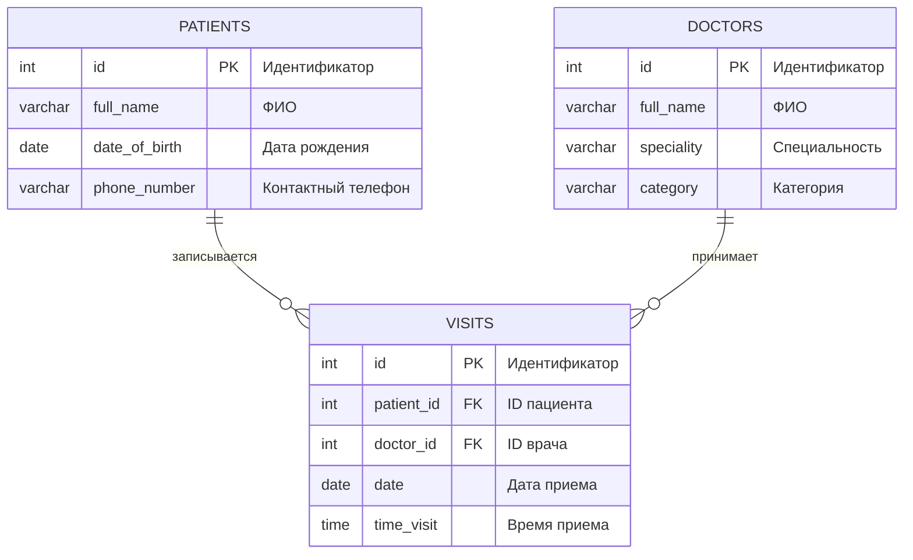

# Лабораторная работа 1. Проектирование структуры БД

## Выбор задачи

**Задание:** Система записи пациентов к врачам

Имеются **Пациенты** (ФИО, дата рождения, контактный телефон) и **Врачи** (ФИО, специальность, категория). Пациент может записаться на прием к нескольким врачам, причем к каждому врачу — на определенную дату и время.

**Выходные документы (запросы):**
1. Выдать список пациентов, записанных к указанному врачу, упорядоченный по ФИО.
2. Выдать список пациентов и количество запланированных у них приемов, упорядоченный по ФИО.

## ER-диаграмма



## Логическая модель

**PATIENTS (Пациенты):**
- id: INTEGER (Первичный ключ)
- full_name: VARCHAR(40) (ФИО)
- date_of_birth: DATE (Дата рождения)
- phone_number: VARCHAR(50) (Контактный телефон)

**DOCTORS (Врачи):**
- id: INTEGER (Первичный ключ)
- full_name: VARCHAR(40) (ФИО)
- speciality: VARCHAR(50) (Специальность)
- category: VARCHAR(50) (Категория)

**VISITS (Записи на прием):**
- id: INTEGER (Первичный ключ)
- patient_id: INTEGER (Внешний ключ к PATIENTS.id)
- doctor_id: INTEGER (Внешний ключ к DOCTORS.id)
- date: DATE (Дата приема)
- time_visit: TIME (Время приема)

**Связи:**
- Один пациент может иметь много записей (1:M)
- Один врач может иметь много записей (1:M)

---

# Лабораторная работа 2. Инсталляция БД на сервере

## Физическая модель для PostgreSQL

```sql
CREATE TABLE IF NOT EXISTS belousov2262.doctors(
    id SERIAL PRIMARY KEY,
    full_name VARCHAR(40),
    speciality VARCHAR(50),
    category VARCHAR(50)
);

CREATE TABLE IF NOT EXISTS belousov2262.patients(
    id SERIAL PRIMARY KEY,
    full_name VARCHAR(40),
    date_of_birth DATE,
    phone_number VARCHAR(50)
);

CREATE TABLE IF NOT EXISTS belousov2262.visits(
    id SERIAL PRIMARY KEY,
    patient_id INT REFERENCES belousov2262.patients(id),
    doctor_id INT REFERENCES belousov2262.doctors(id),
    date DATE,
    time_visit TIME
);
```

## Заполнение таблиц данными

```sql
INSERT INTO belousov2262.doctors (full_name, speciality, category) VALUES
('Иванов Петр Сергеевич', 'Терапевт', 'Высшая'),
('Сидорова Анна Владимировна', 'Кардиолог', 'Первая'),
('Петров Михаил Андреевич', 'Невролог', 'Высшая'),
('Козлова Елена Ивановна', 'Эндокринолог', 'Вторая');

INSERT INTO belousov2262.patients (full_name, date_of_birth, phone_number) VALUES
('Смирнов Алексей Иванович', '1985-03-15', '+7 (912) 345-67-89'),
('Волкова Татьяна Петровна', '1992-07-22', '+7 (923) 456-78-90'),
('Кузнецов Андрей Сергеевич', '1978-11-30', '+7 (934) 567-89-01'),
('Попова Екатерина Викторовна', '2001-05-18', '+7 (945) 678-90-12');

INSERT INTO belousov2262.visits (patient_id, doctor_id, date, time_visit) VALUES
(1, 1, '2024-01-15', '09:30:00'),
(2, 2, '2024-01-16', '10:15:00'),
(3, 3, '2024-01-17', '11:00:00'),
(1, 2, '2024-01-18', '14:20:00'),
(2, 1, '2024-01-19', '15:45:00'),
(3, 1, '2024-01-20', '08:30:00'),
(4, 4, '2024-01-21', '12:10:00');
```

## Проверка нормальных форм

**1NF (Первая нормальная форма):**
- ✓ Все таблицы имеют первичные ключи
- ✓ Все атрибуты атомарны (не содержат составных значений)
- ✓ Нет повторяющихся групп данных

**2NF (Вторая нормальная форма):**
- ✓ Все таблицы находятся в 1NF
- ✓ Все неключевые атрибуты полностью зависят от первичного ключа
- ✓ В таблице `visits` все атрибуты зависят от полного ключа `id`

**3NF (Третья нормальная форма):**
- ✓ Все таблицы находятся в 2NF
- ✓ Отсутствуют транзитивные зависимости
- ✓ Например, в таблице `doctors` нет зависимостей между специальностью и категорией

**4NF (Четвертая нормальная форма):**
- ✓ Отсутствуют многозначные зависимости
- ✓ В таблице `visits` каждый атрибут независим

**5NF (Пятая нормальная форма):**
- ✓ Все таблицы находятся в 4NF
- ✓ Отсутствуют зависимости соединения без потерь
- ✓ Структура данных позволяет естественные соединения без избыточности

**Вывод:** Все таблицы соответствуют требованиям до 5NF включительно.

## Создание дампа базы данных

```bash
pg_dump -n belousov2262 --inserts -U postgres -d database_name > belousov2262_dump.sql
```

**Выполнение содержательных SELECT-запросов**

**Запрос 1:**
```sql
SELECT p.id, p.full_name 
FROM belousov2262.patients AS p
JOIN belousov2262.visits AS v ON v.patient_id = p.id
JOIN belousov2262.doctors AS d ON d.id = v.doctor_id
WHERE d.id = 1
ORDER BY p.full_name;
```

**Запрос 2:**
```sql
SELECT p.id, p.full_name, COUNT(v.id) as visits_count
FROM belousov2262.patients AS p
LEFT JOIN belousov2262.visits AS v ON v.patient_id = p.id
GROUP BY p.id, p.full_name
ORDER BY p.full_name;
```
**Результат Запроса 1:**


**Результат Запроса 2:**


