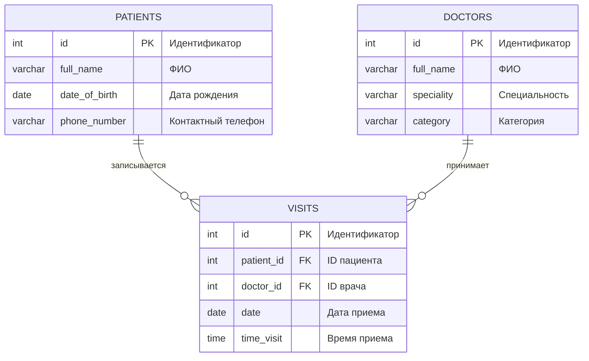

# Лабораторная работа 1

## Задание: Система записи пациентов к врачам

Имеются **Пациенты** (ФИО, дата рождения, контактный телефон) и **Врачи** (ФИО, специальность, категория). Пациент может записаться на прием к нескольким врачам, причем к каждому врачу — на определенную дату и время.

### Выходные документы (запросы)
1. Выдать список пациентов, записанных к указанному врачу, упорядоченный по ФИО.
2. Выдать список пациентов и количество запланированных у них приемов, упорядоченный по ФИО.

## ER-диаграмма



### Преобразование ER-диаграммы в логическую модель

**Сущности и атрибуты:**

**PATIENTS (Пациенты):**
- id: INTEGER (Первичный ключ)
- full_name: VARCHAR(40) (ФИО)
- date_of_birth: DATE (Дата рождения)
- phone_number: VARCHAR(50) (Контактный телефон)

**DOCTORS (Врачи):**
- id: INTEGER (Первичный ключ)
- full_name: VARCHAR(40) (ФИО)
- speciality: VARCHAR(50) (Специальность)
- category: VARCHAR(50) (Категория)

**VISITS (Записи на прием):**
- id: INTEGER (Первичный ключ)
- patient_id: INTEGER (Внешний ключ к PATIENTS.id)
- doctor_id: INTEGER (Внешний ключ к DOCTORS.id)
- date: DATE (Дата приема)
- time_visit: TIME (Время приема)

**Связи:**
- Один пациент может иметь много записей (1:M)
- Один врач может иметь много записей (1:M)

### Проектирование физической модели

**Спецификация для PostgreSQL:**
- Схема: `belousov2262`
- Кодировка: UTF8
- Сравнение: русский_Russia.1251

**Индексы для оптимизации производительности:**
1. Индекс по ФИО пациентов (для сортировки и поиска)
2. Индекс по ФИО врачей (для сортировки и поиска)
3. Индекс по дате приема (для запросов по диапазону дат)
4. Индекс по внешним ключам (для ускорения JOIN-операций)

### Создание DDL-запросов для PostgreSQL

```sql
-- Создание схемы
CREATE SCHEMA IF NOT EXISTS belousov2262;

-- Таблица врачей
CREATE TABLE IF NOT EXISTS belousov2262.doctors(
    id SERIAL PRIMARY KEY,
    full_name VARCHAR(40) NOT NULL,
    speciality VARCHAR(50) NOT NULL,
    category VARCHAR(50) NOT NULL
);

-- Таблица пациентов
CREATE TABLE IF NOT EXISTS belousov2262.patients(
    id SERIAL PRIMARY KEY,
    full_name VARCHAR(40) NOT NULL,
    date_of_birth DATE NOT NULL,
    phone_number VARCHAR(50) NOT NULL
);

-- Таблица записей на прием
CREATE TABLE IF NOT EXISTS belousov2262.visits(
    id SERIAL PRIMARY KEY,
    patient_id INT NOT NULL REFERENCES belousov2262.patients(id) ON DELETE CASCADE,
    doctor_id INT NOT NULL REFERENCES belousov2262.doctors(id) ON DELETE CASCADE,
    date DATE NOT NULL,
    time_visit TIME NOT NULL,
    CONSTRAINT unique_doctor_time UNIQUE(doctor_id, date, time_visit),
    CONSTRAINT unique_patient_time UNIQUE(patient_id, date, time_visit)
);

-- Создание индексов
CREATE INDEX idx_patients_full_name ON belousov2262.patients(full_name);
CREATE INDEX idx_doctors_full_name ON belousov2262.doctors(full_name);
CREATE INDEX idx_visits_date ON belousov2262.visits(date);
CREATE INDEX idx_visits_patient_id ON belousov2262.visits(patient_id);
CREATE INDEX idx_visits_doctor_id ON belousov2262.visits(doctor_id);
```

### Заполнение таблиц данными (минимум 4 строки в каждой)

```sql
-- Заполнение таблицы врачей
INSERT INTO belousov2262.doctors (full_name, speciality, category) VALUES
('Иванов Петр Сергеевич', 'Терапевт', 'Высшая'),
('Сидорова Анна Владимировна', 'Кардиолог', 'Первая'),
('Петров Михаил Андреевич', 'Невролог', 'Высшая'),
('Козлова Елена Ивановна', 'Эндокринолог', 'Вторая');

-- Заполнение таблицы пациентов
INSERT INTO belousov2262.patients (full_name, date_of_birth, phone_number) VALUES
('Смирнов Алексей Иванович', '1985-03-15', '+7 (912) 345-67-89'),
('Волкова Татьяна Петровна', '1992-07-22', '+7 (923) 456-78-90'),
('Кузнецов Андрей Сергеевич', '1978-11-30', '+7 (934) 567-89-01'),
('Попова Екатерина Викторовна', '2001-05-18', '+7 (945) 678-90-12');

-- Заполнение таблицы записей на прием
INSERT INTO belousov2262.visits (patient_id, doctor_id, date, time_visit) VALUES
(1, 1, '2024-01-15', '09:30:00'),
(2, 2, '2024-01-16', '10:15:00'),
(3, 3, '2024-01-17', '11:00:00'),
(1, 2, '2024-01-18', '14:20:00'),
(2, 1, '2024-01-19', '15:45:00'),
(3, 1, '2024-01-20', '08:30:00'),
(4, 4, '2024-01-21', '12:10:00');
```

### Проверка нормальных форм с помощью DeepSeek

**1NF (Первая нормальная форма):**
- ✓ Все таблицы имеют первичные ключи
- ✓ Все атрибуты атомарны (не содержат составных значений)
- ✓ Нет повторяющихся групп данных

**2NF (Вторая нормальная форма):**
- ✓ Все таблицы находятся в 1NF
- ✓ Все неключевые атрибуты полностью зависят от первичного ключа
- ✓ В таблице `visits` все атрибуты зависят от полного ключа `id`

**3NF (Третья нормальная форма):**
- ✓ Все таблицы находятся в 2NF
- ✓ Отсутствуют транзитивные зависимости
- ✓ Например, в таблице `doctors` нет зависимостей между специальностью и категорией

**4NF (Четвертая нормальная форма):**
- ✓ Отсутствуют многозначные зависимости
- ✓ В таблице `visits` каждый атрибут независим

**5NF (Пятая нормальная форма):**
- ✓ Все таблицы находятся в 4NF
- ✓ Отсутствуют зависимости соединения без потерь
- ✓ Структура данных позволяет естественные соединения без избыточности

**Вывод:** Все таблицы соответствуют требованиям до 5NF включительно.

### Создание дампа схемы данных

```bash
# Команда для создания дампа (выполняется в командной строке):
pg_dump -n belousov2262 --inserts -U postgres -d database_name > belousov2262_dump.sql
```

**Содержимое дампа (фрагмент):**
```sql
--
-- PostgreSQL database dump
--

SET statement_timeout = 0;
SET lock_timeout = 0;
SET idle_in_transaction_session_timeout = 0;
SET client_encoding = 'UTF8';
SET standard_conforming_strings = on;
SELECT pg_catalog.set_config('search_path', '', false);
SET check_function_bodies = false;
SET xmloption = content;
SET client_min_messages = warning;
SET row_security = off;

--
-- Name: belousov2262; Type: SCHEMA; Schema: -; Owner: postgres
--

CREATE SCHEMA belousov2262;

-- ... (полный дамп с созданием таблиц, вставкой данных и созданием ограничений)
```

### Выполнение содержательных SELECT-запросов с JOIN 2-3 таблиц

#### Выходной документ 1: Выдать список пациентов, записанных к указанному врачу, упорядоченный по ФИО

```sql
-- Пациенты, записанные к врачу с ID = 1 (терапевту Иванову П.С.)
SELECT 
    p.id as "ID пациента",
    p.full_name as "ФИО пациента",
    p.date_of_birth as "Дата рождения",
    p.phone_number as "Телефон",
    d.full_name as "ФИО врача",
    d.speciality as "Специальность врача",
    v.date as "Дата приема",
    v.time_visit as "Время приема"
FROM belousov2262.patients p
JOIN belousov2262.visits v ON p.id = v.patient_id
JOIN belousov2262.doctors d ON v.doctor_id = d.id
WHERE d.id = 1
ORDER BY p.full_name;
```

**Результат выполнения:**
```
 ID пациента |       ФИО пациента       | Дата рождения |       Телефон       |      ФИО врача      | Специальность врача | Дата приема | Время приема
-------------|--------------------------|---------------|---------------------|---------------------|---------------------|-------------|--------------
           2 | Волкова Татьяна Петровна | 1992-07-22    | +7 (923) 456-78-90  | Иванов Петр Сергеевич | Терапевт           | 2024-01-19  | 15:45:00
           1 | Смирнов Алексей Иванович | 1985-03-15    | +7 (912) 345-67-89  | Иванов Петр Сергеевич | Терапевт           | 2024-01-15  | 09:30:00
           3 | Кузнецов Андрей Сергеевич| 1978-11-30    | +7 (934) 567-89-01  | Иванов Петр Сергеевич | Терапевт           | 2024-01-20  | 08:30:00
```

#### Выходной документ 2: Выдать список пациентов и количество запланированных у них приемов, упорядоченный по ФИО

```sql
-- Все пациенты с количеством их записей
SELECT 
    p.id as "ID пациента",
    p.full_name as "ФИО пациента",
    p.date_of_birth as "Дата рождения",
    p.phone_number as "Телефон",
    COUNT(v.id) as "Количество записей",
    STRING_AGG(DISTINCT d.speciality, ', ') as "Посещаемые специальности"
FROM belousov2262.patients p
LEFT JOIN belousov2262.visits v ON p.id = v.patient_id
LEFT JOIN belousov2262.doctors d ON v.doctor_id = d.id
GROUP BY p.id, p.full_name, p.date_of_birth, p.phone_number
ORDER BY p.full_name;
```

**Результат выполнения:**
```
 ID пациента |       ФИО пациента       | Дата рождения |       Телефон       | Количество записей | Посещаемые специальности
-------------|--------------------------|---------------|---------------------|--------------------|---------------------------
           2 | Волкова Татьяна Петровна | 1992-07-22    | +7 (923) 456-78-90  |         2          | Кардиолог, Терапевт
           3 | Кузнецов Андрей Сергеевич| 1978-11-30    | +7 (934) 567-89-01  |         2          | Невролог, Терапевт
           4 | Попова Екатерина Викторовна| 2001-05-18| +7 (945) 678-90-12  |         1          | Эндокринолог
           1 | Смирнов Алексей Иванович | 1985-03-15    | +7 (912) 345-67-89  |         2          | Кардиолог, Терапевт
```
